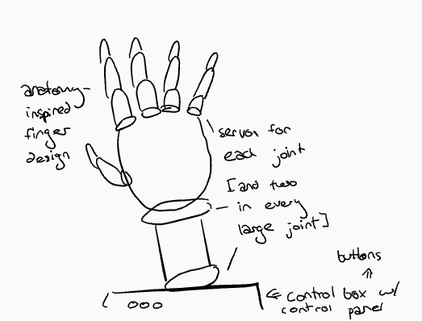
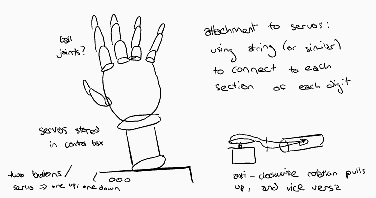
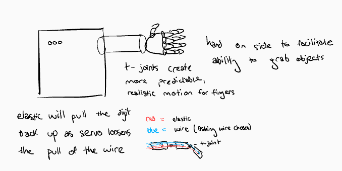
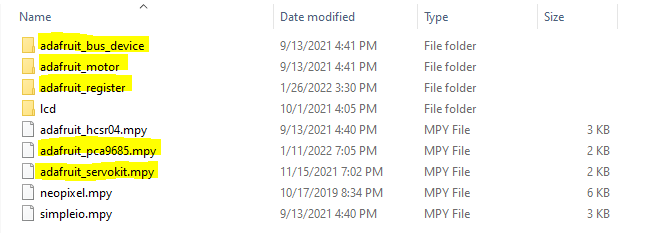
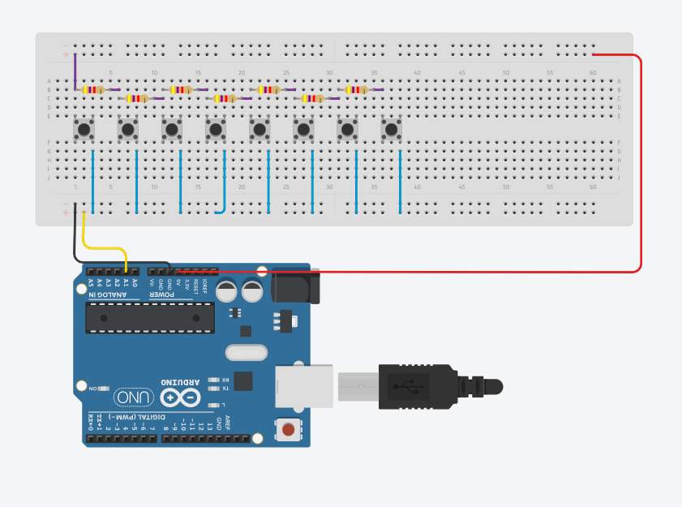

# Robotic_Arm
Articulated arm project, by [Lucy Gray](https://github.com/lgray52) and [Gaby D'Alessio](https://github.com/gdaless20)

## Table_of_Contents
* [Planning](#Planning)
  * [Brainstorming and Iterations](#Brainstorming) 
  * [Materials](#Materials)
  * [Criteria and Constraints](#Criteria_and_Constraints)
  * [Schedule](#Schedule)
* [Problems and Solutions](#Problems_and_Solutions)

## Planning

**Goal of Project:** Our robotic arm will use an atriculated arm design that mimics human movement in order to pick up a can by extending and flexing each joint individually.  

### Brainstorming

#### Possible Solutions and Choice
For this project, we chose to use an articulated arm design out of the six basic types of robotic arms (cartesian, SCARA, cylindrical, delta, polar and articulated) because an articulated arm uses joints to move to it's desired destination. Since part of our original goal was to design a hand that would have the capabilities listed above, we did not consider a different use for an articulated arm, but rather moved through a variety of ideas about the function of the hand and the joints.

#### Base ideas and First Iteration

The preliminary design for this project was pretty preliminary. The articulated arm-with-hand design we had decided on, but we were unsure how the servos might be used to make the joints of the fingers, wrist, and elbow move. We had an idea that we wanted each joint to be able to be individually controlled to go up and down, and that using buttons, one for each up or down movement, would be the best way to achieve control of this individual motion.

#### Second Iteration

For the second iteration of the plan, we expanded on preliminary ideas and decided on placing the servos in the box. We decided to connect them to each section of each digit using wire or string, and using one string with it's middle tied to connection points on each digit and it's ends attached to either side of a servo horn to create back and forth rotation by pulling backwards or forwards with the rotation of the servo. We decided to use one servo per joint, except for the wrist and elbow which would use two, or 18 servos in total (32 buttons for 16 total joints). We anticpate this might be a problem when it comes to number of servos programming programs can support, and are planning to use a second board if necessary. 

#### Final Plan

The final plan included some fairly major changes from our first design solutions. We decided to orient the hand on the side of the box so it would be actually able to grab things on a surface, and to use t-joints rather than ball joints in all of the joints in the hand. We also decided to use elastic to pull the digits back up to their original position, which we figured out we were able to do while doing a proof of concept for the motion of the joints with a servo, meaning that we will be able to eliminate the complications of trying to have one string pull two different ways and the corresponding mechanics. 

### Materials
* 3D Printing Material
* Elastic
* Fishing line
* Servos
* Metro board
* Wood
* Wires
* Acrylic
* Buttons
* Glue
* Screws

### Criteria_and_Constraints

#### Criteria
* This hand should be able to grasp an object that can fit in a hand
* It should resemble a human hand in size, shape, and function

#### Constraints
* Ability of boards available in the lab to run the target number of servos
* Target finish date 1st of February
* Mr. Helmstetter says Gaby is a safety concern; also knives and soldering
* Modelling the hand - how joints will work and move

### Schedule

**Finish Goal 01 Feb**

Rough Timeline:
* Finish code & box design by winter break
* CAD completely finished by mid-January (snow day delay 1 week - CAD completed by late Jan)
* Around mid January, have box set up for hand assembly and have preliminary wiring done 
* Assemble hand, fit with strings, and attach to servo late January

Gaby - main CAD; Lucy - code, secondary CAD

[Back to Table of Contents](#Table_of_Contents)

## Problems_and_Solutions

### General:
* It became aparent very quickly that a nomenclature was needed to keep variables for servos, angles, and buttons separate. Each finger is a value 1-5: thumb is 1, pointer 2, middle , ring 4, and pinky 5 -- the wrist and elbow joints are 0. The next number would be the joint in the finger: 1 for the base joint where the digit meets the palm, the metacarpophalangeal, 2 for the middle, the proximal interphalangeal, and 3 for the top joint at the tip, the distal interphalangeal. The elbow is 0-1 and the wrist is 0-2.

### Coding:
* Running 16 servos with one board
  * The first challenge was figuring out what exactly could solve this problem. The solution ended up being [this](https://www.adafruit.com/product/815) servo driver, capable of running 16 servos at one time. This driver came with a CircuitPython library for ease of coding.
  * Or so I thought. The CircuitPython library included some problematically named files and code examples with different coding grammar, but eventually worked. Until it didn't. After break, all of the libraries refused to collaborate with one another because some of the libraries had been updated to .py files rather than .mpy files. This meant they took up too much space because they were text files and not binary, and they would not run the .mpy files because they had been updated to CircuitPython 7. This took several classes to figure out, but I was able to update them all to CircuitPython 7 and .mpy files. Here is a picture of the correct files needed (they are all CircuitPython version 7). 
  
* Running 32 buttons with one board
  * This was an equal problem to the servos, however the solution was slightly simpler. Using an analog_in function, the electrical value of a pin can be returned and printed. Using this idea, by placing resistors between buttons to reduce the amount of electricity flowing through the chain of buttons, a single analog pin can read the differing frequencies, and this can be used to run several buttons (I got up to 11 easily differentiable values). This is [Mr. Helmstetter's](https://github.com/helmstk1) orginal idea. I ended up having to use 4.7k Ω resistors in order to have enough resistance to reduce the value significantly enough to esaily differentiate the values produced.
  
* Wiring note - make sure the batteries are oriented right. It *will* save you 30 minutes, or potentially a battery exploding on you!
* For simplicity, Mr. Helmstetter asked that I arranged variables into arrays instead of naming them according to the system, so they are named a little differently in the code. An explanation of arrays is in the code itself.

[Back to Table of Contents](#Table_of_Contents)
